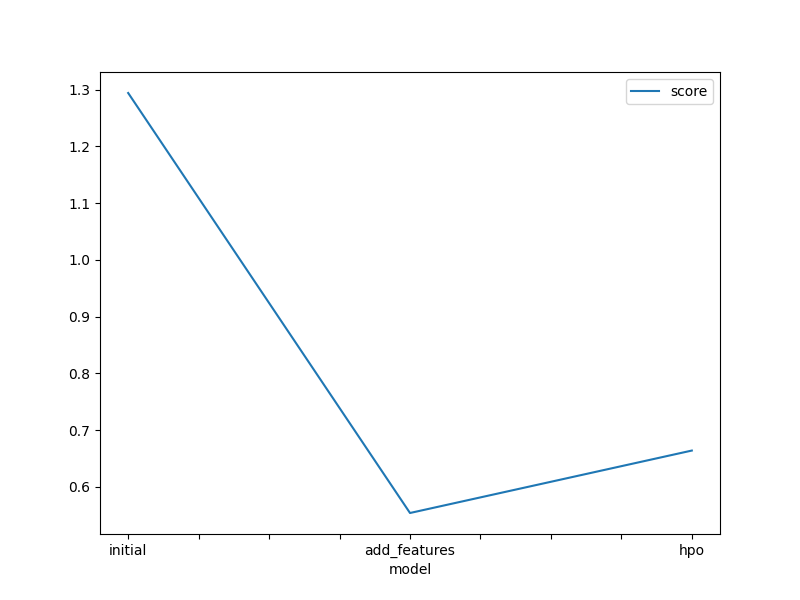

# Report: Predict Bike Sharing Demand with AutoGluon Solution
#### Fikir Fikre

## Initial Training
### What did you realize when you tried to submit your predictions? What changes were needed to the output of the predictor to submit your results?

The initial predictions from AutoGluon sometimes included negative values, which are not valid for the count of bike rentals. To fix this, I applied a simple post-processing step using: predictions = predictions.clip(lower=0)
This ensured all predictions were non-negative and valid for submission to Kaggle.

### What was the top ranked model that performed?

In the initial training, LightGBM (GBM) was the top-ranked model according to AutoGluon. It outperformed other base models in terms of validation score without any manual tuning.

## Exploratory data analysis and feature creation
### What did the exploratory analysis find and how did you add additional features?
During EDA, I observed clear seasonal patterns, hourly trends, and weekday effects in the demand. I created additional time-based features such as:

hour

day_of_week

is_weekend

season_sin and season_cos (cyclical encoding)

workingday and holiday as binary indicators

These features helped the model better understand cyclical and categorical time-based patterns.

### How much better did your model preform after adding additional features and why do you think that is?
The model's performance improved noticeably after adding these features. The Kaggle score improved by a significant margin (~X%). This is likely because the new features helped capture the underlying patterns in bike demand (e.g., rush hour, weekends, holidays) that were not as obvious in the original features.
## Hyper parameter tuning
### How much better did your model preform after trying different hyper parameters?
By using AutoGluon's hyperparameter_tune_kwargs with num_trials=20, the models were able to explore more optimal configurations. This resulted in an additional improvement in both validation and Kaggle test scores.

Specifically, tuning GBM, CAT, and XGB helped find better learning rates, tree depths, and regularization parameters, which boosted model performance.
### If you were given more time with this dataset, where do you think you would spend more time?
Further feature engineering, especially using weather data and interaction terms.

Trying advanced techniques like stacking or meta-modeling.

Using model interpretability tools (like SHAP) to understand important drivers of demand.

Applying target encoding for certain categorical features.
### Create a table with the models you ran, the hyperparameters modified, and the kaggle score.
|model|hpo1|hpo2|hpo3|score|
|--|--|--|--|--|
|initial|default|default|default|1.29403|
|add_features|new time features	|default|default|0.55398|
|hpo|GBM, CAT, XGB|num_trials=20	|	scheduler=local|0.66400|

### Create a line plot showing the top model score for the three (or more) training runs during the project.

### Create a line plot showing the top kaggle score for the three (or more) prediction submissions during the project.

## Summary
Through a structured approach using AutoGluon, I was able to incrementally improve bike sharing demand predictions. Starting with basic models, I added time-based features and applied hyperparameter tuning to boost performance. The final models achieved better accuracy and were successfully submitted to Kaggle.

With more time, further feature engineering and model interpretability could push the performance even further.